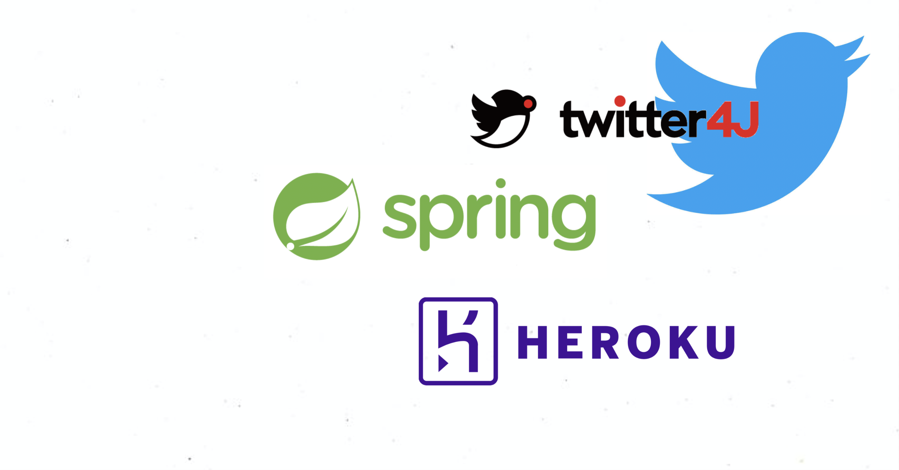
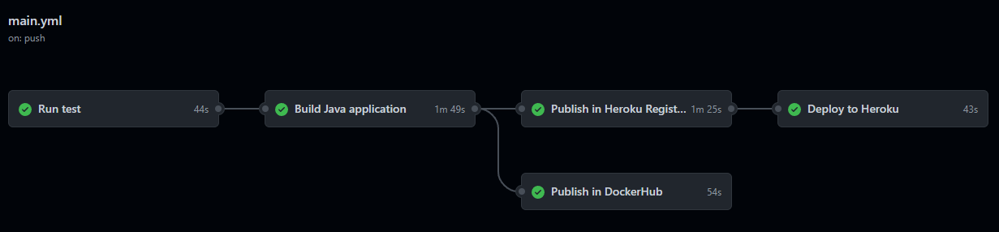

# Master Cloud Apps 

### Trabajo Fin de Master

# Aplicación de planificación de redes sociales con TBD y CI/CD

Alumnos: 
Andrea Colina 
Juan Manuel Guijarro

Tutor: Francisco Gortázar


---

## Índice
- Introducción
- Tecnologías 
- Trunk Based Development 
- CI/CD
- Conclusiones

---


#[fit] Que es TBD-SOCIAL
#[fit] -NETWORKS-PLANNER ?

---


---


---


---


---


---



---


---


---


---


---


---

## Características: 
### Trunk Based Development 

- Ramas de corta duración 
- Commits pequeños
- Se trabaja sobre __trunk__
- Pull requests sobre main (trunk)
- Uso de técnicas de CI/CD 


---

## Técnicas aplicadas: 
### Trunk Based Development 


- Feature Toggles
- Branch by Abstraction

---

## Técnicas aplicadas: Feature Toggles
### Trunk Based Development 
- Importamos la libreria FF4J: 


- Creamos un feature toggle: 

```java
public static String FEATURE_ABSTRACT_IG_CLIENT = "Instagram client";

if (!ff4j.exist(FEATURE_ABSTRACT_IG_CLIENT)) {
            ff4j.createFeature(FEATURE_ABSTRACT_IG_CLIENT, false);
}
```

---

## Técnicas aplicadas: Feature Toggles
### Trunk Based Development 

- Usamos el toggle:
 
```java
if (ff4j.check(FEATURE_ABSTRACT_IG_CLIENT)) {
    // New code (if toggle is active)
    return this.instagramRestClient.login();

} else {
    // Old code
    DeviceLoginRequest deviceLoginRequest = DeviceLoginRequest.builder()
        .accessToken(loginAccessToken)
        .redirectUri(redirectUri)
        .scope(scope)
	...
```

---
## Técnicas aplicadas: Feature Toggles
### Trunk Based Development 

Activamos y desactivamos el toggle a través de la interfaz grafica: 


[https://ais-tbd-social-networks.herokuapp.com/ff4j-web-console/features](https://ais-tbd-social-networks.herokuapp.com/ff4j-web-console/features)

---
## Técnicas aplicadas: Branch by Abstraction
### Trunk Based Development 

Abstraemos la implementación de una funcionalidad a través de una *interfaz*.

Nos permite *intercambiar* las implementaciones.

Ambas implementaciones *coexisten* en el proyecto.

---

## Técnicas aplicadas: Branch by Abstraction
### Trunk Based Development 
- Creación de la interfaz: 

```java
public interface InstagramClient {

    InstagramDeviceLoginResponse login() throws InstagramException;

    String authenticate() throws InstagramException;

    String post(ResourceResponse resource, String caption) throws InstagramException;

    InstagramPostInfoResponse getPostInfo(String id) throws InstagramException;

    InstagramMediaResponse getAllMedia() throws InstagramException;

}
```
---

## Técnicas aplicadas: Branch by Abstraction
### Trunk Based Development 
- Implementation de la interfaz: 

```java
public class InstagramRestClient implements InstagramClient {

	@Override
	public InstagramDeviceLoginResponse login() throws InstagramException {
	...
```

--- 

## Técnicas aplicadas: Branch by Abstraction
### Trunk Based Development 
- Uso de feature flag para activar desactivar la funcionalidad: 

```java
if (ff4j.check(FEATURE_ABSTRACT_IG_CLIENT)) {
	// Nueva implementación
	return this.instagramRestClient.login();

} else {
     // Código antiguo
     try {
        log.info("Request to Facebook Business API: " + deviceLoginUrl);

        ResponseEntity<InstagramDeviceLoginResponse> response = 
	this.restTemplate.exchange(deviceLoginUrl, HttpMethod.POST, 
	getEntity(deviceLoginRequest.toJsonString()), InstagramDeviceLoginResponse.class);
              ...
```

---


## Técnicas aplicadas: Branch by Abstraction
### Trunk Based Development 
- Futuros pasos:  

 Esta abstracción nos va a facilitar en un futuro sustituir el cliente Rest por una librería, por ejemplo. 

---

## CI/CD

- GitHub Actions
- Testeo Automatizado

---

## GitHub Actions
### CI/CD


---

## GitHub Actions
### CI/CD




---

## Testeo Automatizado

- Tests Unitarios
- Tests de Integración

---

## Conclusiones: 

- Periodo de adaptación corto
- Conciencia de equipo
- GitHub Actions 

---

## Futuros pasos

- Gestión de *versiones*
- Gestión de *usuarios*
- Terminar de configurar *callback* de Instagram
- *Branch by Abstraction* en Twitter Client

---

#[fit] Gracias!
